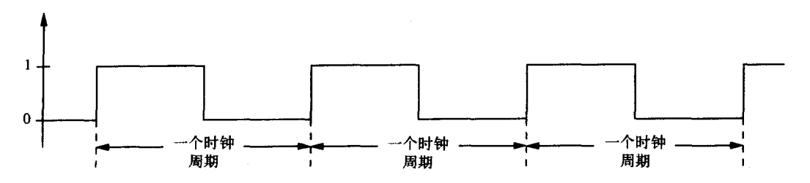

# 有限状态机笔记

> 《计算机系统概论》- Patt.Y.N 读书笔记

### 时序电路
我们通常将逻辑电路分为 **可储存信息的电路** 与 **不可储存信息的电路**。其中 可储存信息的电路 又成为 逻辑组合电路，逻辑组合电路的特点就是无法得知电路之前的状态。而时序电路通过将这两种电路组合，使得逻辑电路的输出与**历史状态**相关。

### 时序性的具象实例
 通过这个实例直观地感受一下 **时序逻辑电路** 与 **组合逻辑电路** 之间有什么区别。
 ||
 |:---:|
 |fig(1) 两种密码锁 ( *左边是时序实例，右边是组合实例* )| 
 左边那种锁必须按照顺序来转动转盘到指定位置，比如密码是`R13-L22-R3`，在输入第一个密码时，你左转转盘至13是不会成功开锁的，虽然显示的都是13。
 右边那种锁，只要每个位的数字能够对应，不管你的转动顺序如何都是会成功开锁的。
 所以我们通常称左边那种锁为时序锁，右边那种锁称为组合锁。对应时序逻辑电路 与 组合逻辑电路。

### 状态机简述

为什么要在介绍状态机前引入时序这个概念？因为时序逻辑电路是实现有限状态机的重要部分。
状态机的概念介绍:
- 状态: 系统在特定时刻和特定条件下的快照
  上述时序锁有闭锁且无外部操作，闭锁且输入一个正确密码，闭锁且输入两个正确密码，开锁…… 
- 外部输入
   系统的状态转移取决于外部输入
- 对外输出
   系统输出可由当前状态决定，也可由当前状态与当前输入共同决定
- 任意状态间迁移
- 对外输出操作

我们通常使用状态图来表示FSM，如下:
||
|:---:|
|时序锁状态图|
FSM还有一个重要的特性——状态转移的触发机制。在时序锁中所谓的触发，即前一轮转动结束、一下一个逆方向转动开始之前，就是它的转移触发。通常状态转移是通过时钟电路来触发的，在电路实现中**FSM的状态转移发生在每个始终周期的起始时刻**。
||
|:---:|
|时钟信号电位图|

### 有限状态机的逻辑电路实现
实现状态图如下的，交通警示牌:
||
|:---:|
|交通警示牌状态图|

