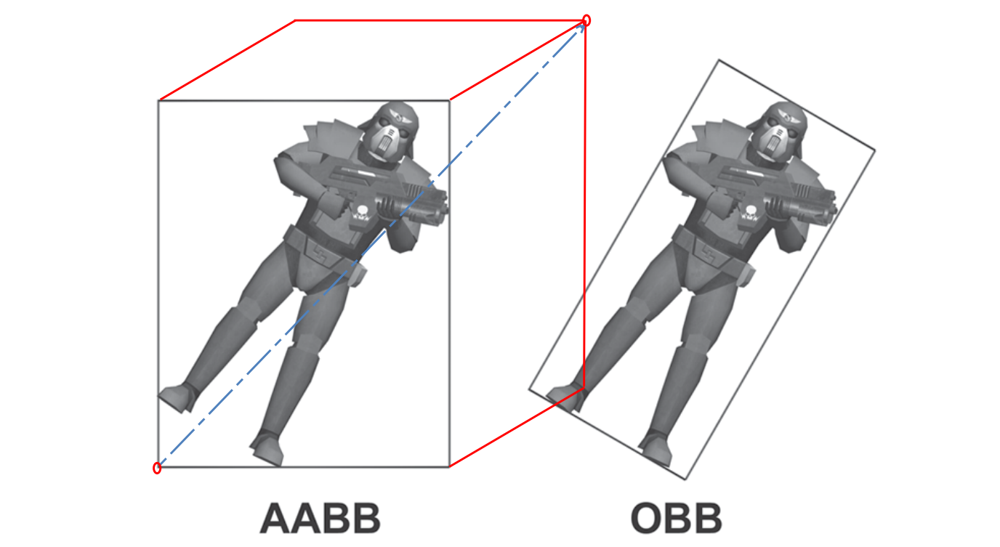

# OcTree Note

### **问题引入**
现有一个巨大的场景，场景内有数量巨大的GameObject，且每个GameObject的Mesh各不相同。需求是付出能够接受的性能，让我们知道每一帧场景内有哪些GameObject相交。


##### **1.暴力检测**
```c#
foreach(gameObject myObject in ObjList)
{
	foreach(gameObject otherObject in ObjList) 
	{ 
		if(myObject == otherObject) continue; //avoid self collision check 
		if(myObject.CollidesWith(otherObject)) 
		{ 
		//code to handle the collision 
		} 
	} 
}
```
虽然是$O(N^2)$的复杂度，但是在场景中对象较少的时候还是可以用的(检测次数少于100)

在遇到碰撞检测方面的性能瓶颈时可以考虑下面几种方法去优化:

1. 检查碰撞检测算法内是否包含了大量的`Sqrt()`方法，由于大部分的原生的开方方法都是使用牛顿迭代法来做，性能消耗较大。特别是计算两个对象距离时，要使用距离的平方而不是平方根来做。
2. 是否能够减少参与计算碰撞检测的对象？
   将那些运动确定的且不会与其他对象发生碰撞的对象不做碰撞检测，比如将对象分为静止对象列表与运动对象列表，只对运动对象列表做碰撞检测。
3. 建立碰撞检测的优先级……
4. **使用空间划分方法**


### **2.基于空间划分方法的检测**
还是上述的那个场景，我们把场景从中间一分为二，根据对象所处的空间，我们可以把对象放入三个列表中，处于左半边的对象放在列表A中，处于右半边的对象放在列表B中，被划分线穿过的对象我们放在列表C中。


我们可以确定，ListA中的对象不可能与ListB中的对象相交，故我们只需要对AB列表中的对象各自求交，以及ListC中的对象与A和B中的对象求交。

那么问题来了，如果对象不均匀，比如所有对象全都聚集在空间的左半边，那么这么做空间划分也无济于事。还有对象如果每帧都在移动且趋势无法预测，难道每一帧都要生成一棵树吗？

### 2.1 **要不要进行分割？怎么进行分割？**
要不要进行分割的准则是:分割是否减少了碰撞检测的次数，而不是为每个对象创造一个完美的包围空间。

是否要继续进行分割的准则:
1.  创造的新的分支若只含有一个对象，那么就不需要再进行分割。(这条规则会被用于八叉树叶子节点的定义)
2.  设置最小分割尺寸。为了防止调用的栈内存溢出，再分隔到最小尺寸的空间后，停止继续分割，最小尺寸内的对象只能用$O(N^2)$的暴力检测方法。
3.  如果区域内不包含任何对象，则不把这块区域放入树中。
如果以上述规则为依据，为二维场景进行划分，结果如下图


### 2.2 **浅谈八叉树**
所以通过上面二维平面的四叉树推导，我们现在需要把理论推广到三维空间中去
下面是GameDev上对节点类的描述与源码
1. Each node has a bounding region which defines the enclosing region
2. Each node has a reference to the parent node
3. Contains an array of eight child nodes (use arrays for code simplicity and cache performance)
4. Contains a list of objects contained within the current enclosing region
5. I use a byte-sized bitmask for figuring out which child nodes are actively being used (the optimization benefits at the cost of additional complexity is somewhat debatable)
6. I use a few static variables to indicate the state of the tree

```C#
public class OctTree
{ 
	BoundingBox m_region;
	List m_objects; 
	/// 
	/// These are items which we're waiting to insert into the data structure. 
	/// We want to accrue as many objects in here as possible before we inject them into the tree. This is slightly more cache friendly. 
	/// 
	
	static Queue m_pendingInsertion = new Queue(); 
	
	/// 
	/// These are all of the possible child octants for this node in the tree. 
	/// 
	OctTree[] m_childNode = new OctTree[8]; 
	
	///
	/// This is a bitmask indicating which child nodes are actively being used. 
	/// It adds slightly more complexity, but is faster for performance since there is only one comparison instead of 8. 
	///
	byte m_activeNodes = 0;
	
	///
	/// The minumum size for enclosing region is a 1x1x1 cube. 
	///
	const int MIN_SIZE = 1; 
	
	///
	/// this is how many frames we'll wait before deleting an empty tree branch. Note that this is not a constant. The maximum lifespan doubles
	/// every time a node is reused, until it hits a hard coded constant of 64 
	/// 
	int m_maxLifespan = 8; // 
	int m_curLife = -1; //this is a countdown time showing how much time we have left to live 
	
	/// 
	/// A reference to the parent node is nice to have when we're trying to do a tree update. 
	/// 
	OctTree _parent; 
	static bool m_treeReady = false; //the tree has a few objects which need to be inserted before it is complete 
	static bool m_treeBuilt = false; //there is no pre-existing tree yet. 
}
```

### 2.3 八叉树的初始化
1. 确认整棵树所包含的范围。在初始化整棵树所包围的空间时我们需要做出下面两条设计决策
- 在对象超出所包含的范围时，我们应该怎么做
- 我们应该把包围的空间定义成什么样
  
GamDev上提供的构造函数：
```C#
private OctTree(BoundingBox region, List objList) 
{ 
	m_region = region; 
	m_objects = objList; 
	m_curLife = -1; 
} 

public OctTree() 
{ 
	m_objects = new List(); 
	m_region = new BoundingBox(Vector3.Zero, Vector3.Zero); 
	m_curLife = -1; 
}

public OctTree(BoundingBox region) 
{ 
	m_region = region;
	m_objects = new List(); 
	m_curLife = -1; 
} 
```
由于下文涉及到BoundingBox的应用，所以这里给出《Character Animation With Direct3D》(这本书在我的icloud里面有),中给出的AABB类的定义。下图中蓝色的向量表示两个位于体对角线上的两个点相减，`Vector3 dimensions = m_region.MAX - m_region.MIN`从而得出`dimensions`。


```C++
class AABB
{
public:
	AABB(D3DXVECTOR3 max, D3DVECTOR3 min)
	{
		m_max = max;
		m_min = min;
	}	

	bool Intersect(D3DVECTOR3 &P)
	{
		if(p.x < m_min.x || p.x > m_max.x)return false;
		if(p.y < m_min.y || p.y > m_max.y)return false;
		if(p.z < m_min.z || p.z > m_max.z)return false;
		return true;
	}

public:
	/*
	* 这里的m_max,m_min 与下文中的m_region.MAX,m_region.MIN对应
	* m_max与m_min分别代表体对角线的两个点
	*/
	D3DVECTOR3 m_max,m_min; 
}
```

2. 要了解[Lazy initialization](https://en.wikipedia.org/wiki/Lazy_initialization#C#)。要尽量拖延内存的分配和构造树，知道我们不得不去做这件的时候。比如果说在用户发出手动插入节点的请求。

### 2.4 `BulidTree()`
在调用`OctTree(BoundingBox region, List objList)`后能够确定了要进行空间划分的空间和在空间中的对象列表。
开始正式构建OcTree的逻辑步骤
1. 判断当前要生成的节点是否为叶子节点。
```c#
// 上文有说明八叉树叶子节点的定义
if (m_objects.Count <= 1)
	return;
```
2. 获取在初始化时(调用构造函数时)传入的`objList`与`region`，分别获取场景中所包含的对象和场景的大小。
```c#
Vector3 dimensions = m_region.MAX - m_region.MIN;

// 若构造时没有传入region
if (dimensions == Vector3.Zero)
{
	// To create a cube which perfect encloses every single object in the game world.
	FindEnclosingCube(); 

	dimensions = m_region.Max - m_region.Min;
}

// 记住要检查创造出的box是否符合上面规定的MIN_SIZE
if (dimensions.X <= MIN_SIZE && dimensions.Y <= MIN_SIZE && dimensions.Z <=MIN_SIZE)
{
	return;
}
```

3. 分割空间(<font size = "1">下面的代码对划分后空间所对应的BoundingBox进行定义，理解没有什么难度，就不多做介绍。</font>)

```C#
Vector3 half = dimensions/2.0f;
Vector3 center = m_region.Min + half;
BoundingBox[] octant = new BoundingBox[8];

octant[0] = new BoundingBox(m_region.Min,center); // 左下角
octant[1] = new BoundingBox(new Vector3(center.X, m_region.Min.Y, m_region.Min.Z), new Vector3(m_region.Max.X, center.Y, center.Z));
octant[2] = new BoundingBox(new Vector3(center.X, m_region.Min.Y, center.Z), new Vector3(m_region.Max.X, center.Y, m_region.Max.Z));
octant[3] = new BoundingBox(new Vector3(m_region.Min.X, m_region.Min.Y, center.Z), new Vector3(center.X, center.Y, m_region.Max.Z));
octant[4] = new BoundingBox(new Vector3(m_region.Min.X, center.Y, m_region.Min.Z), new Vector3(center.X, m_region.Max.Y, center.Z));
octant[5] = new BoundingBox(new Vector3(center.X, center.Y, m_region.Min.Z), new Vector3(m_region.Max.X, m_region.Max.Y, center.Z));
octant[6] = new BoundingBox(center, m_region.Max);
octant[7] = new BoundingBox(new Vector3(m_region.Min.X, center.Y, center.Z), new Vector3(center.X, m_region.Max.Y, m_region.Max.Z));
```

4. 分配对象至节点

```C#

```

